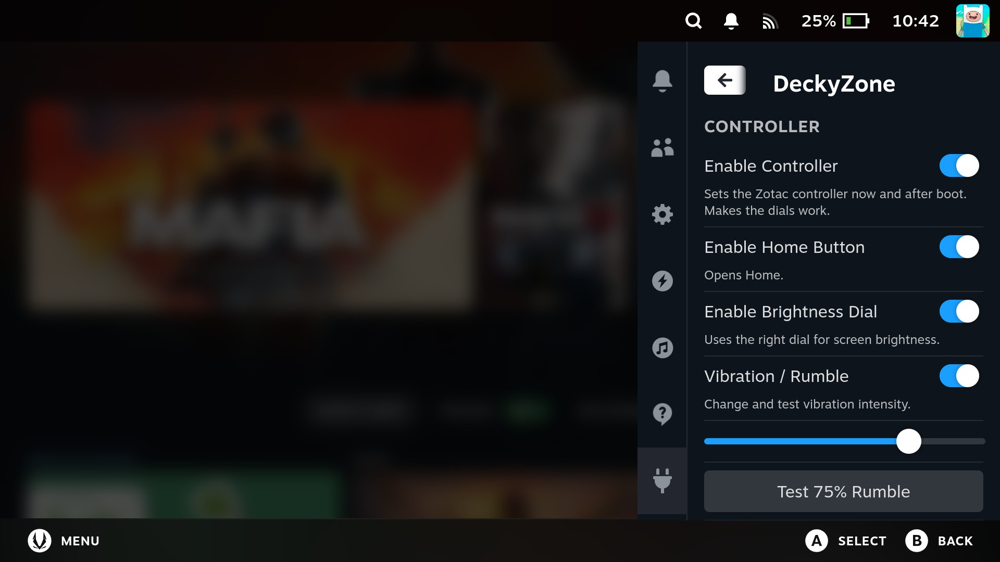

# DeckyZone

[](https://github.com/DeckFilter/DeckyZone/releases)
[](https://github.com/DeckFilter/DeckyZone/releases/latest)
[](https://github.com/DeckFilter/DeckyZone/releases/latest)

DeckyZone is a Decky plugin for the Zotac Gaming Zone that aims to bridge the most common compatibility gaps until full compatibility lands. I started with controller-related fixes first, because those were the first issues I ran into and I was especially hyped about getting the dials working.



## Installation

Run the following in terminal:

```bash
curl -L https://raw.githubusercontent.com/DeckFilter/DeckyZone/main/install.sh | sh
```

## Current Features

Status key: ✅ tested/working, ❌ not currently working in my testing, ❓ untested or unknown.

### Controller

| Feature                               | SteamOS `main` | Bazzite | Nobara | CachyOS |
| ------------------------------------- | -------------- | ------- | ------ | ------- |
| Enable Controller Features            | ✅             | ❌      | ❓     | ❓      |
| Controller Mode status and recovery   | ✅             | ❌      | ❓     | ❓      |
| Home Button navigation                | ✅             | ❌      | ❓     | ❓      |
| Brightness Dial control               | ✅             | ❌      | ❓     | ❓      |
| Trackpad Mode: Default                | ✅             | ❌      | ❓     | ❓      |
| Trackpad Mode: Disabled               | ✅             | ❌      | ❓     | ❓      |
| Trackpad Mode: Directional Buttons    | ✅             | ❌      | ❓     | ❓      |
| Vibration / Rumble Intensity          | ✅             | ✅      | ❓     | ❓      |
| Test Rumble                           | ✅             | ❌      | ❓     | ❓      |
| Per-game Trackpad and Rumble settings | ✅             | ❌      | ❓     | ❓      |
| Per-game Button Prompt Fix            | ✅             | ❌      | ❓     | ❓      |

Controller Features is the master switch for the InputPlumber-based controller runtime. Home Button and Brightness Dial are dependent toggles: disabling Controller Features also turns both of them off.

Trackpad modes:

- `Default`: normal controller behavior with mouse available.
- `Disabled`: turns off both trackpads.
- `Directional Buttons`: left trackpad is D-pad, right trackpad is A/B/X/Y.

### Interface

| Feature             | SteamOS `main` | Bazzite | Nobara | CachyOS |
| ------------------- | -------------- | ------- | ------ | ------- |
| Enable Zotac Glyphs | ✅             | ❓      | ❓     | ❓      |

Zotac Glyphs applies Zotac controller button glyphs and controller images in Steam UI.

### Display

| Feature                   | SteamOS `main` | Bazzite | Nobara | CachyOS |
| ------------------------- | -------------- | ------- | ------ | ------- |
| Enable Zotac OLED Profile | Built in       | ✅      | ❓     | ❓      |
| Enable Green Tint Fix     | ✅             | ✅      | ❓     | ❓      |

Display changes require a reboot after toggling them. `HDR / Washed out colors` was fixed out of the box in my SteamOS `main`, SteamOS 3.8.1 Preview, Bazzite, Nobara, and CachyOS testing.

## Compatibility Notes

Controller features rely on InputPlumber and Zotac input/HID support. Non-SteamOS compatibility depends on what that OS image currently ships and exposes to Decky Loader.

## Related Plugins

### TDP & Fan Control

- [PowerControl](https://github.com/mengmeet/PowerControl)

I already contributed patches there and it's included in the latest release. It was much faster to extend this plugin than to integrate the same functionality into DeckyZone itself.

### RGB Control

- [HueSync](https://github.com/honjow/HueSync)

I already contributed patches there. It was again much faster to extend this plugin than to integrate the same functionality into DeckyZone itself.

## Feedback

Feedback is really appreciated. Please open an issue if you have feedback, bugs, or feature requests.

If you would like to talk directly, you can also join the Discord server:

- https://discord.gg/dyMMQNKdMH

## Future Ideas

These are ideas, not promised features.

### Display

- Startup movie(s)

### Troubleshooting / Tips & Tricks

- Camera detected status
- EC and display firmware details
- Battery warning to help prevent BIOS reset

## Credits

Projects currently inspiring DeckyZone:

- [Legion Go Remapper](https://github.com/aarron-lee/LegionGoRemapper)
- [HueSync](https://github.com/honjow/HueSync)
- [PowerControl](https://github.com/mengmeet/PowerControl)
- [DeckyPlumber](https://github.com/aarron-lee/DeckyPlumber)
- [OpenZone](https://github.com/OpenZotacZone/ZotacZone-Drivers)
