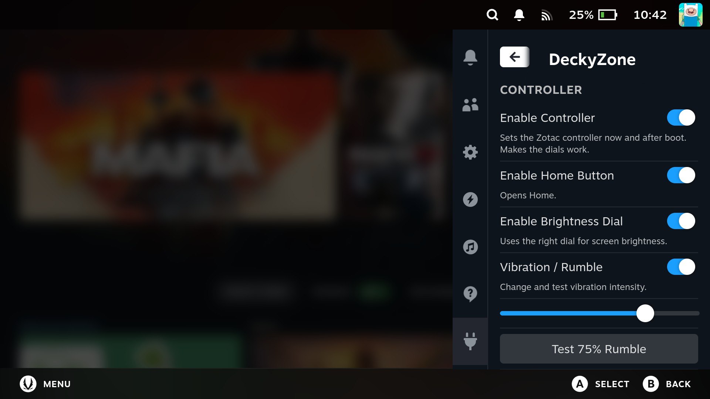

# DeckyZone

[](https://github.com/DeckFilter/DeckyZone/releases)
[](https://github.com/DeckFilter/DeckyZone/releases/latest)
[](https://github.com/DeckFilter/DeckyZone/releases/latest)

DeckyZone is a Decky plugin for the Zotac Gaming Zone that aims to bridge the most common compatibility gaps until full compatibility lands. I started with controller-related fixes first, because those were the first issues I ran into and I was especially hyped about getting the dials working.



## Installation

Run the following in terminal:

```bash
curl -L https://raw.githubusercontent.com/DeckFilter/DeckyZone/main/install.sh | sh
```

## Current Features

Status key: ✅ tested/working, ❌ not currently working in my testing, ❓ untested or unknown, — unavailable by design.

All compatibility fixes are opt-in and can be disabled at any time.

### Controller

| Feature                               | SteamOS `main` | Bazzite | CachyOS |
| ------------------------------------- | -------------- | ------- | ------- |
| Controller Mode status and recovery   | ✅             | ✅      | ✅      |
| Home Button navigation                | ✅             | ✅      | ✅      |
| Brightness Dial control               | ✅             | ✅      | ✅      |
| Gyro Orientation Fix                  | ✅             | ✅      | ✅      |
| Trackpad Mode: Default                | ✅             | ✅      | ✅      |
| Trackpad Mode: Disabled               | ✅             | ✅      | ✅      |
| Trackpad Mode: Directional Buttons    | ✅             | ✅      | ✅      |
| Vibration / Rumble Intensity          | ✅             | ✅      | ✅      |
| Test Rumble                           | ✅             | ✅      | ✅      |
| Per-game Trackpad and Rumble settings | ✅             | ✅      | ✅      |
| Per-game Button Prompt Fix            | ✅             | ✅      | ✅      |

DeckyZone activates its InputPlumber controller runtime while Home Button, Brightness Dial, a non-default trackpad mode, or an active per-game controller override needs it. Returning the last dependent feature to its default restores the inherited controller target.

Gyro Orientation Fix installs a temporary DeckyZone-owned InputPlumber Zotac IMU mount-matrix override until the upstream device profile includes the same matrix.

Trackpad modes:

- `Default`: normal controller behavior with mouse available.
- `Disabled`: turns off both trackpads.
- `Directional Buttons`: left trackpad is D-pad, right trackpad is A/B/X/Y.

### Customization

| Feature                    | SteamOS `main` | Bazzite | CachyOS |
| -------------------------- | -------------- | ------- | ------- |
| Zotac Controller Artwork   | ✅             | ✅      | ✅      |
| Hide Unsupported Controls  | ✅             | ✅      | ✅      |
| Remaining Battery Time Fix | ❓             | —       | —       |

Zotac Controller Artwork replaces supported Steam controller previews, calibration images, and button glyphs with Zotac versions.

Hide Unsupported Controls removes the unused L5 and R5 controls and Steam Input trackpad settings that do not work with the Zotac Zone. The physical trackpads remain available through DeckyZone's Trackpad Mode setting. Existing installations inherit the previous controller-artwork behavior when this separate setting is first added.

Remaining Battery Time Fix is available only on SteamOS. It passes UPower's charging and discharging estimates to Steam through `/run/vpower` while leaving Valve's `vpower` service running. It turns itself off after `vpower` provides valid estimates for both states.

### Display

| Feature                   | SteamOS `main` | Bazzite | CachyOS |
| ------------------------- | -------------- | ------- | ------- |
| Enable Zotac OLED Profile | Built in       | ✅      | ✅      |
| Green Tint Compensation   | ✅             | ✅      | ✅      |

Display changes require a reboot after toggling them. `HDR / Washed out colors` was fixed out of the box in my SteamOS `main`, SteamOS 3.8.1 Preview, Bazzite, and CachyOS testing.

Green Tint Compensation only changes the Gamescope profile's white point. It does not correct the panel's brightness-dependent tint. On my unit, manual testing found the issue from 12% through 35% brightness; 11% and 36% looked neutral. The exact range may vary between panels.

#### Display research resources

- [Zotac display and EC firmware update guide](https://www.zotac.com/de/faq/zotac-gaming-zone-how-update-display-firmware-or-battery-indicator-firmware)
- [DXQ7D0023 / Chipone ICNA3512 panel driver](https://github.com/csvke/panel-chipone-icna3512)
- [ICNA3512 panel initialization reference](https://github.com/csvke/panel-chipone-icna3512/blob/master/reference/video_120HZ_DSC%E4%BB%A3%E7%A0%81/20240620_ICNA3512_GVO_G1700_1080x1920_12bit_befor_OP1_V03_GammaRetune_90_120Hz_HDR_10bitDSC.txt)
- [Gamescope AYANEO 3 OLED display pull request](https://github.com/ValveSoftware/gamescope/pull/2347)
- [AYN Odin 2 Portal firmware notes](https://github.com/ChimeraGaming/AYN-OTA-Changelogs/blob/main/Odin_2.md)
- [Valve Galileo Mura extractor](https://gitlab.com/evlaV/galileo-mura-extractor)
- [MuraDeck](https://github.com/Moonveil-Kanata/MuraDeck)
- [Linux LT7911EXC bridge driver patch](https://lkml.iu.edu/hypermail/linux/kernel/2604.3/08913.html)

### Performance

| Feature   | SteamOS `main` | Bazzite | CachyOS |
| --------- | -------------- | ------- | ------- |
| VRAM Size | ❓             | ✅      | ✅      |

VRAM Size sets the UMA framebuffer size (4-8GB, same range as the Zotac launcher on Windows). The Zone stores this setting in a CMOS byte that the BIOS reads at boot, so changes require a reboot to apply. The panel shows both the active size and the pending size until then. Resetting the BIOS (e.g. after full battery drain) reverts it to the 4GB default.

## Compatibility Notes

Controller features rely on InputPlumber and Zotac input/HID support. Non-SteamOS compatibility depends on what that OS image currently ships and exposes to Decky Loader.

## Related Plugins

### TDP & Fan Control

- [PowerControl](https://github.com/mengmeet/PowerControl)

I already contributed patches there and it's included in the latest release. It was much faster to extend this plugin than to integrate the same functionality into DeckyZone itself.

### RGB Control

- [HueSync](https://github.com/honjow/HueSync)

I already contributed patches there. It was again much faster to extend this plugin than to integrate the same functionality into DeckyZone itself.

## Feedback

Feedback is really appreciated. Please open an issue if you have feedback, bugs, or feature requests.

If you would like to talk directly, you can also join the Discord server:

- https://discord.gg/dyMMQNKdMH

## Future Ideas

These are ideas, not promised features.

### Display

- Startup movie(s)

### Troubleshooting / Tips & Tricks

- Camera detected status
- Battery warning to help prevent BIOS reset

## Credits

Projects currently inspiring DeckyZone:

- [Legion Go Remapper](https://github.com/aarron-lee/LegionGoRemapper)
- [HueSync](https://github.com/honjow/HueSync)
- [PowerControl](https://github.com/mengmeet/PowerControl)
- [DeckyPlumber](https://github.com/aarron-lee/DeckyPlumber)
- [OpenZone](https://github.com/OpenZotacZone/ZotacZone-Drivers)
