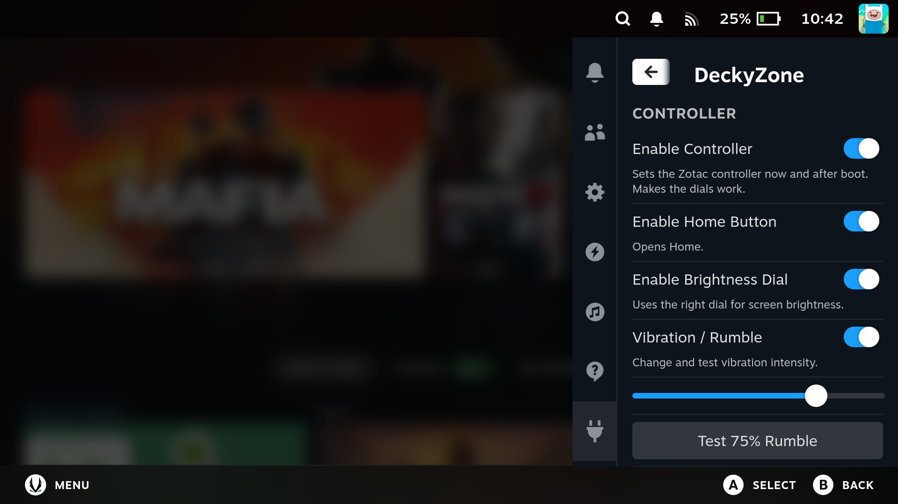

# DeckyZone

[](https://github.com/DeckFilter/DeckyZone/releases)
[](https://github.com/DeckFilter/DeckyZone/releases/latest)
[](https://github.com/DeckFilter/DeckyZone/releases/latest)

DeckyZone is a Decky Loader plugin for the Zotac Gaming Zone. It adds controller settings, display fixes, native Steam performance controls and fan curves.



## Installation

Run this command in a terminal:

```bash
curl -L https://raw.githubusercontent.com/DeckFilter/DeckyZone/main/install.sh | sh
```

## Compatibility

✅ tested and working · ❓ untested · N/A unavailable

| Feature                         | SteamOS  | Bazzite           | CachyOS           |
| ------------------------------- | -------- | ----------------- | ----------------- |
| Controller mode recovery        | ✅        | ✅                 | ✅                 |
| Dials, trackpads and rumble     | ✅        | ✅                 | ✅                 |
| Steam Home action               | ✅        | ✅                 | ✅                 |
| Gyro Orientation Fix            | ✅        | ✅                 | ✅                 |
| Per-game controller settings    | ✅        | ✅                 | ✅                 |
| Zotac Controller Artwork        | ✅        | ✅                 | ✅                 |
| Hide Unsupported Controls       | ✅        | ✅                 | ✅                 |
| Remaining Battery Time Fix      | ✅        | N/A               | N/A               |
| Zotac OLED Profile              | Built in | ✅                 | ✅                 |
| Green Tint Compensation         | ✅        | ✅                 | ✅                 |
| VRAM Size                       | ✅        | ✅                 | ✅                 |
| Native performance controls     | ✅        | Not yet supported | Not yet supported |
| Custom fan curves               | ✅        | ❓                 | ❓                 |

Controller features require InputPlumber and the ZONE's input drivers. Support on other distributions depends on the drivers and software they include.

Disable PowerControl and SimpleDeckyTDP in Decky settings before using native performance controls or custom fan curves. Turning off their TDP switches is insufficient. Enabling either plugin turns native controls off and returns the fan to System Auto. After disabling it, re-enable native controls or select your fan curve again. Installed but disabled plugins do not block these features.

## Features

### Controller

Open **Controller settings** to configure mappings and rumble globally or per game. Games without custom settings use your global settings. You can edit saved game profiles without launching a game, or delete them to return to global settings.

- Assign volume, brightness or custom commands to either dial.
- Use each trackpad as a mouse, scroll wheel or button pad, or disable it.
- Adjust and test rumble strength, and enable Xbox controller simulation per game.
- Set the Home button to take a screenshot or open Steam Home for all games.

Gyro Orientation Fix corrects the gyro on InputPlumber versions that need it. Changing this setting restarts InputPlumber. Turn it off once InputPlumber includes the fix.

### Customization

Zotac Controller Artwork replaces Steam's supported controller images and button glyphs with Zotac versions. Hide Unsupported Controls removes L5, R5 and unsupported Steam Input trackpad settings. Configure the physical trackpads in **Controller settings > Trackpads**.

Remaining Battery Time Fix shows estimated charging time and remaining battery time in SteamOS. It turns itself off when the system provides both estimates.

### Display

Enable the Zotac OLED Profile on Bazzite or CachyOS; SteamOS includes it. Green Tint Compensation adjusts the white point, but may not fix tint at low brightness. Reboot after changing display settings.

### Performance

VRAM Size reserves 4 to 8 GB of memory for the GPU. Higher values leave less memory for games and the system. Reboot to apply a change. A BIOS reset, including one caused by a fully drained battery, restores the 4 GB default.

#### Native performance controls

Turn on **Performance > Native Performance Controls** in DeckyZone to add profiles to Steam's Performance menu:

| Profile     | Power limit |
| ----------- | ----------- |
| Low Power   | 8 W         |
| Balanced    | 15 W        |
| Performance | 28 W        |
| Custom      | 8 to 28 W   |

The TDP slider appears only in Custom. Steam saves per-game selections; keep DeckyZone loaded to restore them. These presets use ONE Launcher's wattages and leave CPU boost, GPU clocks and fan settings unchanged.

Setup installs the required files and can repair them after a SteamOS update. If the controls do not appear, use DeckyZone's **Restart Steam** option.

DeckyZone currently supports native controls on SteamOS with a ZONE G0A1W, BIOS 1.20, Ryzen 7 8840U and SteamOS Manager `26.4.0` or newer. It checks compatibility before enabling the controls. Bazzite and CachyOS support still needs implementation and device testing.

Turning off Custom's TDP limit can request 28 W. Disabling or removing native controls leaves the last power limit in place.

<details>
<summary>Bridge diagnostics and removal</summary>

Inspect support without changing settings:

```sh
cd /var/lib/deckyzone-performance
sudo python3 -m services.performance_bridge probe
```

Remove native performance support and restore the system configuration:

```sh
cd /var/lib/deckyzone-performance
sudo python3 -m services.performance_bridge.install rollback --enable
```

</details>

### Fan control

Open **Fan control** to choose System Auto or a saved curve. System Auto is the default. Curves apply to all games, and the quick-access graph shows the active curve.

Create and edit named curves without applying them, or import saved curves with **Import from PowerControl**. Importing leaves PowerControl's settings unchanged. Fixed-speed profiles are not imported. Deleting the active curve returns the fan to System Auto.

Custom curves use at least 10% fan speed and reach 100% at 95°C. The fan returns to System Auto if control fails, before sleep and when DeckyZone unloads. Your curve resumes after wake. Use **Restore System Auto** if another plugin left the fan in manual mode.

Fan control works without native performance controls. It requires the G0A1W's `zotac_platform` fan driver, `k10temp` sensor, systemd and `dbus-next`.

## Feedback

Open an issue to report a bug or request a feature, or join the [Discord server](https://discord.gg/dyMMQNKdMH).

## Credits

Inspired by:

- [Legion Go Remapper](https://github.com/aarron-lee/LegionGoRemapper)
- [HueSync](https://github.com/honjow/HueSync)
- [PowerControl](https://github.com/mengmeet/PowerControl)
- [DeckyPlumber](https://github.com/aarron-lee/DeckyPlumber)
- [OpenZone](https://github.com/OpenZotacZone/ZotacZone-Drivers)

The fan editor is adapted from PowerControl under its BSD 3-Clause license. Copyright and license details are in LICENSE. For RGB lighting, use HueSync.
