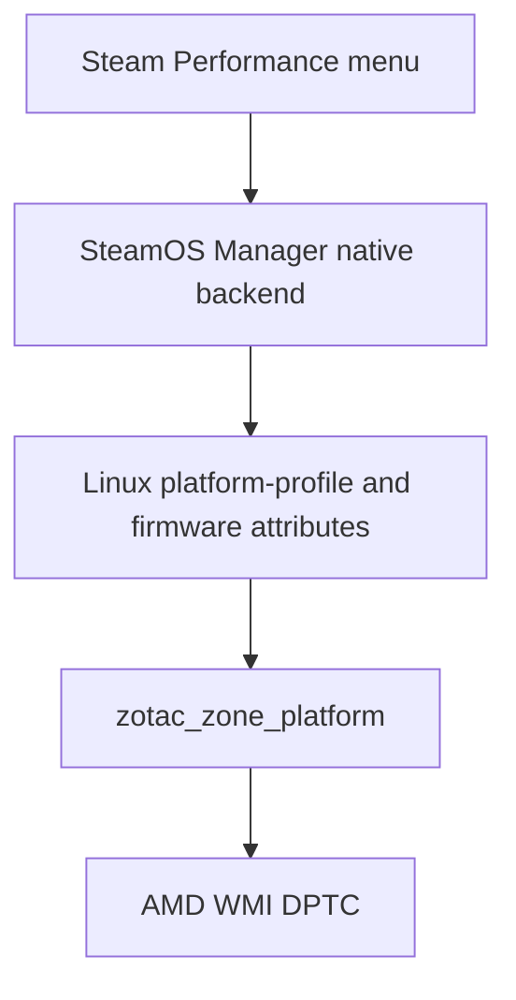

# Native Steam performance profiles and TDP investigation

**Current result, 2026-09-25: native Performance QAM is working on the device.** The later implementation uses a validated RyzenAdj fallback and SteamOS Manager's supported `--device-config` override. See the deployment record below and the [service documentation](../../services/performance_bridge/README.md). The earlier investigation sections preserve the evidence and limitations of the initially proposed sysfs path.

Initial investigation: the installed SteamOS Manager contains a matching native backend and device configuration. Its expected Linux power interfaces are absent because the running kernel does not enumerate the AMD WMI GUID that the ZOTAC driver requires. A bridge using those sysfs paths cannot currently apply anything.

The initial hardware investigation was read-only; the later authorized deployment and power tests are recorded below. The initial conditional provider's fixture tests ran as `deck` in a temporary device directory on a private D-Bus, then removed their files and bus. The [local evidence directory](/Users/felixhirschfeld/steamos-linux-projects/zotac-zone-specific/ZOTAC_FINDINGS/native-performance-2026-09-25) retains device findings, assembly versions, decoded method bodies, ACPI/BMOF evidence, test results, Steam source excerpts, and the disassembly script. Temporary analysis tools and source checkouts are at `/tmp/deckyzone-performance-20260925.05dakv`.

The repository source reviewed was `938157f76eca505de9e094e925b4d0e81703f636`. Existing GitHub issues and open PRs were checked; none described this performance-profile integration. No issue, comment, PR, push, or other external write was made.

**What the live ZONE exposes**

SSH snapshot time: `2026-09-25T06:16:54Z`, with later read-only follow-ups during the same session.

| Item | Observed value |
| --- | --- |
| OS | SteamOS 3.9.1, build `20260914.100` |
| Kernel | `7.2.4-valve1-1-neptune-72-g5ab4af5e2eb9` |
| Kernel package | `linux-neptune-72 7.2.4.valve1-1` |
| BIOS | `1.20`, reported date `09/06/2024` |
| DMI | Vendor `ZOTAC`, board `G0A1W`, product `ZOTAC GAMING ZONE` |
| SteamOS Manager | Package `26.4.1-2`; CLI `26.4.1`; system and user daemons running |
| Steam | `steamdeck_stable`, Steam UI changelist `10971728` |
| ZOTAC modules | `zotac_zone_platform` and `zotac_zone_hid` loaded, in-tree, owned by the installed Neptune package |
| Platform module source version | `6E49D8DD83074F8F35F590A` |
| Driver binding | `/sys/bus/platform/drivers/zotac_zone_platform/zotac_zone_platform` exists |
| Platform-profile class | No devices under `/sys/class/platform-profile` |
| Legacy profile interface | No `/sys/firmware/acpi/platform_profile*` nodes |
| Firmware attributes | No devices under `/sys/class/firmware-attributes`; no PPT values or ranges to read |
| ZOTAC hwmon | `/sys/class/hwmon/hwmon5/name` is `zotac_platform`; fan/temperature nodes exist |
| Manager device identity | `("zotac_gaming_zone", "G0A1W")` |
| Manager performance interfaces | Neither `PerformanceProfile1` nor `TdpLimit1` present in session-bus introspection or `steamosctl get-all-properties` |
| Remote configuration | No TOML files in either `remotes.d` directory; `RemoteInterfaces` is empty |
| Competing manager | PowerControl 3.15.1 running |
| Other power daemons | No installed packages named `hhd`, `adjustor`, or `power-profiles-daemon`; no matching HHD/Adjustor/TLP/tuned/power-profile service entries in the inspected inventory |

The complete enumerated WMI device list was:

```text
ABBC0F6A-8EA1-11D1-00A0-C90629100000-0
05901221-D566-11D1-B2F0-00A0C9062910-1
```

The required `1f72b0f1-bfea-4472-9877-6e62937ab616` is absent. The second GUID above does not substitute for it. In the matching kernel source, `zotac_platform_probe()` sets `wmi_dptc_supported` using `wmi_has_guid()` for the missing GUID. Both `platform_profile_setup()` and `create_power_attributes()` return without registering their interfaces when it is false. The module can bind and expose hwmon in that state. This explains the observed combination without assuming a stripped driver. [Matching Neptune source](https://github.com/evlaV/linux-integration/blob/5ab4af5e2eb942863190be262cc48b134b7cd6d6/drivers/platform/x86/zotac-zone-platform.c#L951)

Follow-up ACPI evidence narrows this further. The device's DSDT, 27 SSDTs, and WMI BMOF were read without evaluating any ACPI method. None of those table blobs contains the expected GUID in its normal WMI byte representation. SSDT15's `_WDG` instead declares the two enumerated GUIDs. `bmf2mof` from [pali/bmfdec](https://github.com/pali/bmfdec) identifies the callable class as `AMD_ACPI`, GUID `ABBC0F6A-8EA1-11D1-00A0-C90629100000`. Its method 5 is `RunCommand`; method 9 is `GetRmpData`. ACPICA `iasl` disassembly independently shows `WMAA(Arg1 == 9)` calling `AM09`, which returns the memory-profile `RMPD` buffer. No `UMAInterface` or `SendDptcCmd` class/method is declared in this BMOF. Substituting that GUID into the driver's method-9 call would target an unrelated interface.

This still does not establish the provenance of the driver's expected GUID or whether other BIOS revisions expose it. A Windows driver can supply WMI classes itself, so ONE Launcher's named `UMAInterface` lookup does not prove an ACPI interface with that name exists in this BIOS. No Windows runtime or firmware modification was used. There is no evidence linking the discrepancy to a ZONE Pro.

**Source comparison and driver limits**

The [Neptune package recipe](https://github.com/evlaV/jupiter/blob/master/linux-neptune-72/PKGBUILD) selects tag `7.2.4-valve1`, resolving to commit `5ab4af5e2eb942863190be262cc48b134b7cd6d6`, matching the running kernel's revision suffix. Its platform source, the cited [OpenZONE source](https://github.com/OpenZotacZone/ZotacZone-Drivers/blob/af8b114792e70ac7e4f578e93a2dfc561bbc3ff7/driver/platform/zotac-zone-platform.c), and the platform C file extracted from the cited [full patch](https://github.com/sirlucjan/kernel-patches/blob/fe25e9f2c684bc4465f5febc698b6cfb40a6de73/7.2/handheld-patches-v2-sep/0072-zotac-zone-hid-initial-impl.patch) are byte-identical:

```text
SHA-256 35ef5962310bbfc918916c04edeae035851317d3723e15f1ecad417632033e44
```

This comparison establishes matching source and package provenance, not a reproducible binary build. A configuration flag alone was not used as proof of working hardware support. CachyOS packaging was consulted as a reference; it is not the installed kernel and supplies no additional runtime evidence here.

The source's preset table is Low Power `5/10/15`, Balanced `12/19/26`, and Performance `28/35/45` watts for its SPL/SPPT/FPPT fields. All three writable attributes instead advertise `8–28 W`. Neither table is a validated hardware envelope for this device. The attribute setter updates its cached value and profile before the command; the profile setter stops after the first failed command, but cannot undo earlier writes. Presets overwrite the custom values. Setup attempts Balanced and ignores that setter's return value. `send_dptc_cmd()` uses method 9 and checks ACPI call success without interpreting the returned firmware payload. These are separate validation requirements before enabling writes.

**The native manager path already exists**

The installed `/usr/share/steamos-manager/devices/zotac-gaming-zone.toml` matches upstream v26.4.1 exactly, SHA-256 `3c66fb9c5f40403d38399619d80fb376ed0ab9520948903096f2fa6bc97eb644`. `pacman -Qkk steamos-manager` reported 67 files and zero altered files. The config names `zotac_zone_platform`, suggests `custom`, selects `firmware_attribute`, and restricts manual TDP to that profile. [Device configuration](https://github.com/evlaV/steamos-manager/blob/v26.4.1/data/devices/zotac-gaming-zone.toml)

The intended path on a device exposing those attributes is:



DeckyZone does not need to sit in this write path. Its existing DMI checks, module/path diagnostics in `main.py`, and opt-in settings patterns can support capability reporting and an eventual enablement flow. There is no reusable TDP writer in DeckyZone today; `PerformancePanel.tsx` currently handles VRAM, and the README delegates TDP/fans to PowerControl.

The v26.4.1 public API uses service `com.steampowered.SteamOSManager1` and object `/com/steampowered/SteamOSManager1` on the session bus:

| Interface | Properties |
| --- | --- |
| `PerformanceProfile1` | `AvailablePerformanceProfiles: as` read-only; `PerformanceProfile: s` read/write; `SuggestedDefaultPerformanceProfile: s` read-only |
| `TdpLimit1` | `TdpLimit: u` read/write; `TdpLimitMin: u`, `TdpLimitMax: u` read-only |

The ZOTAC backend reads the SPL value/range and writes SPL, SPPT, then FPPT using watts. SPPT and FPPT are raised to their individual minima when necessary; only the SPL range is used for the public range. Returning to Custom does not itself restore a separately saved custom wattage. [Backend implementation](https://github.com/evlaV/steamos-manager/blob/v26.4.1/steamos-manager/src/power.rs#L517)

Native profile changes query whether TDP is active and add or remove `TdpLimit1` accordingly. Profile discovery requires nonempty kernel choices, explaining why no profile interface appeared here. The public TDP setter queues work and can acknowledge it before a hardware write finishes; a successful D-Bus reply alone is insufficient application evidence. [Profile and TDP handling](https://github.com/evlaV/steamos-manager/blob/v26.4.1/steamos-manager/src/manager/user.rs#L849)

The supported remote mechanism uses TOML sections such as `[PerformanceProfile1]` and `[TdpLimit1]`, each containing `bus_name` and `object_path`, under `/usr/share/steamos-manager/remotes.d` or `/etc/steamos-manager/remotes.d`. Providers implement the public interface names on the **system bus**. Native implementations take precedence; existing configured providers can appear/disappear dynamically, but adding configuration is not a runtime registration operation. [Interoperability documentation](https://github.com/evlaV/steamos-manager/tree/v26.4.1#interoperability)

The [HHD example](https://github.com/OuinOuin74/hhd-steamos-bridge/tree/cd689764b187090b02397cb7092b1bfd25eba2af) implements TDP/GPU, not the requested profile contract. Its v26.3.0 startup-deadlock report must not be assumed current: v26.4.1 starts the TDP service before configuring interfaces. Its multi-interface registration warning still warrants a controlled test if a remote is ever needed. There is a further ZONE-specific obstacle: its configured firmware backend does not implement the remote proxy setter, so dropping in a TDP remote does not automatically replace the selected backend. No competing remote was registered.

**Steam client evidence and its limits**

The installed Steam bundle `chunk~2dcc5aaf7.js` has SHA-256 `f9606b111203c9140dcdd6fc016a0ee00e4c8406aeb786187c42873f08d071fb`. Its profile dropdown depends on `platform_performance_profiles_available`. The inspected mapping uses the returned strings as labels, so the exact capitalization and friendly wording requested are not established. Its native TDP slider requires both `is_tdp_limit_available` and `steamos_tdp_limit_enabled`, and uses a 1 W step. Custom alone does not prove that the slider will be visible without the TDP toggle.

Read-only CEF inspection reached `SharedJSContext` and `SystemPerfStore`. The older performance store still reports a generic `3–30` TDP range, even though the manager lacks `TdpLimit1`; that range is not evidence of a usable or safe ZONE power interface. No matching controls were visible in the currently rendered inspected pages. The Performance menu was not opened or manipulated.

The client contains per-game settings machinery, but this investigation did not prove that it saves/restores this platform profile together with its custom TDP. Profile changes, slider changes, per-game switching, suspend/resume, and AC/battery transitions were deliberately not exercised. A bridge-owned persistence scheme should not be added until those behaviors are measured.

**ONE Launcher binary findings**

The existing extraction is `/Users/felixhirschfeld/steamos-linux-projects/zotac-zone-specific/ONELauncher_v2.1.44.0/extracted`. `AppxManifest.xml` and `ZotacHandheldInstaller.exe` identify version `2.1.44.0`; individual assemblies report `1.0.0.0`. Method bodies were decoded locally from PE/CLI metadata and CIL using `dnfile`/`dncil`. The binaries were not executed.

| File relative to the extraction | SHA-256 / version evidence |
| --- | --- |
| `nested/Package_2.1.44.0_x64/msix/FullTrust/FullTrust.dll` | `307dc2085bab72060f57ac6ec35f1401b3e8e711b495964bd51a8549c522d824`; product `1.0.0+9951077c26be370a414d8afa619ad96e9aa724b2` |
| `nested/Package_2.1.44.0_x64/msix/ZotacHandheldLibrary.dll` | `91e047addd6b9e92d2a54df67e1f3fa61e9d235aaa82305dbb8724538576fb5b`; same product revision |
| `nested/ZotacHandheldDatabaseService_20251119/ZotacHandheldDatabaseService.exe` | `e2758a9d782ab548e53537aa9d32095200504e3fc39e75cf30142b4b78f216e0`; file/product `1.0.0.0` |
| `nested/ZotacHandheldDatabaseService_20251119/ZotacHandheldLibrary.dll` | `07f987e1f8a579aebd0399ef0804cec279e8d656ec4d5d3b40cbd3fc285460aa`; product `1.0.0+e851bd01af44f4e82e1b9a1c722e5183efac3a81` |

`PerformanceProfile.GetDefaultProfiles()`, RVA `0x9a2c`, confirms the same relevant defaults in both library variants:

| Preset | Thermal power limit | CPU boost enum | Windows power mode enum |
| --- | --- | --- | --- |
| Quiet | 8 W | 0, Disabled | 0, Efficiency |
| Balance | 15 W | 1, Enabled | 1, Balanced |
| High | 28 W | 2, Aggressive | 2, Performance |
| Custom | 15 W | 1, Enabled | 1, Balanced |

These are model defaults, not measured hardware readings. The profile application method invokes the TDP provider and CPU boost/power policy setters. EPP has a separate enable flag, false in those defaults; the table does not establish that every preset writes EPP. Fan and other fields exist but are outside this milestone.

Two distinct hardware paths must be kept separate:

1. `FullTrust.dll`, `PCPIPC.PerformanceServiceImp.RequestTDP(double)` at RVA `0x3d1c`, loops enum values 0–2. Its typed overload at `0x3d40` clamps to 8–30 W, caches the requested value, converts to milliwatts, and calls RyzenAdj in order **Slow → STAPM → Fast**, discarding return codes. This path does not prefer UMA.
2. `ZotacHandheldDatabaseService.exe`, `Common.PerfromanceManager` (spelling in the binary), initializes RyzenAdj before trying `root\WMI` / `SELECT * FROM UMAInterface`. If that instance exists, it selects `RequestTDPUMA`; otherwise it selects `RequestTDPRyzenAdj`. That is selection at initialization, not a proven fallback after an individual UMA write fails.

For the database service, `RequestTDP(double)` is at RVA `0x6a6c`, its typed overload at `0x6b94`, and `RequestTDPUMA` at `0x6af0`. The typed overload applies the same 8–30 W clamp and ×1000 conversion. The three calls receive equal values:

| Order | Windows enum | UMA command ID | Argument |
| --- | --- | --- | --- |
| 1 | Slow = 0 | 7 | clamped watts × 1000, UInt32 |
| 2 | Stapm = 1 | 5 | same |
| 3 | Fast = 2 | 6 | same |

`RequestTDPUMA` invokes the named WMI method `SendDptcCmd` with a byte command and UInt32 value; it discards the return and catches exceptions. The Windows numeric WMI method ID and its GUID were not established by this named invocation. Method 9 and the GUID above are facts about the Linux implementation.

There is a concrete mapping discrepancy to resolve: Linux assigns command 6 to its SPPT field and 7 to FPPT, while this Windows code names 7 Slow and 6 Fast. Equal-limit Windows writes hide that distinction; the unequal Linux presets do not. Neither the Linux preset values nor successful Windows method dispatch proves ONE Launcher equivalence or safe application on this ZONE.

**PowerControl cannot yet be treated as fan-only**

Update after the user disabled it: Decky's saved `disabled_plugins` includes `PowerControl`, confirmed again by the deployed read-only probe. Its internal saved `enabled` flag remains true; that does not override Decky's plugin disable state. The earlier observations below describe its previously enabled behavior. This removes that known active owner for current debugging, but no general exclusive-owner guarantee or fan-only configuration has been established.

The live configuration has `enabled=true`, `enableNativeTDPSlider=false`, `tdpBackend="auto"`, and `pollingEnabled=false`. Multiple saved game/battery profiles have `tdpEnable=true`, with CPU boost, governor, EPP, and scheduler settings also present. Recent logs show attempted RyzenAdj operations, including a reset while undervolting was disabled, and report failures finding a compatible `ryzen_smu` module. These prove competing write paths and attempts, not successful or continuous application of TDP. Disabling its native slider or polling is insufficient evidence of exclusive ownership. Its relevant startup, resume, game-change, and AC-change handlers must be checked before retaining fan control alongside the native manager.

**Concrete proposal and acceptance gates**

1. **Resolve the missing Linux interface first.** Compare the firmware's ACPI/WMI definitions and Windows UMA provider metadata read-only to determine whether the expected GUID is appropriate for this hardware/BIOS. A corrected, maintained kernel interface may be necessary. Do not substitute the other enumerated GUID, remove the capability check, install a driver, or add userspace EC/WMI writes on this evidence. Any later driver test needs separate authorization because probe/setup can change power state.
2. **Use the existing manager once the kernel exposes working controls.** Require a bound named profile device, all four choices, and three complete power-attribute directories with consistent ranges. Recheck firmware return handling, cache updates, partial-write behavior, command mapping, and preset limits first. There is no missing ZOTAC manager TOML to install on this OS. New kernel nodes may require a later, explicitly authorized manager/Steam restart for discovery.
3. **Keep DeckyZone opt-in and diagnostic.** Add a capability result that distinguishes module missing, unbound driver, missing WMI interface, incomplete attributes, missing manager interface, competing writer, and ready. On this device it must report unavailable with the missing-interface reason. Do not silently enable controls or advertise official Valve/ZOTAC device support.
4. **Choose one owner before write tests.** Prefer native SteamOS Manager. Establish a verified PowerControl fan-only configuration or disable its conflicting behavior with approval. A bridge becomes a separate proposal only for a proven kernel ABI that the installed native backend cannot use; it must not compete with this backend. For such a provider, preserve last custom TDP separately only if Steam does not, validate every limit, serialize transactions, report partial failure honestly, and withdraw capability on device loss.
5. **Validate behavior before claiming completion.** Record requested limits, driver caches, command/error evidence, and independently observed workload behavior separately. Monitor current power and temperature using read-only telemetry during controlled workloads; neither cached sysfs values nor wall/battery power is a direct measurement of an individual firmware limit.

| Later controlled test | Required evidence |
| --- | --- |
| Discovery/startup | Correct D-Bus properties, four profile choices, agreed labels, no startup surprise writes |
| Every preset transition | Ordered command completion, firmware-error handling, correct reported profile, no competing writes |
| Enter/leave Custom | TDP interface and UI appear/disappear as intended; determine whether the toggle is retained |
| Slider values and boundaries | 1 W steps within validated bounds; all three intended limits applied; reject invalid input |
| Custom → preset → Custom | Previous custom value restored by an identified owner; no success inferred from the preset's cache |
| Two games plus global profile | Confirm profile and TDP persistence together; record actual call order and avoid duplicate per-game storage |
| Suspend/resume and AC/battery | Settings either remain effective or are reapplied by the sole owner; fan-only setup stays fan-only |
| Fault injection in a mock backend | First/second/third-command failures cannot become a reported successful transaction; handle stale cache and disappearance |
| Disable/uninstall/reboot | Predictable ownership handoff and startup state; no unapproved reset of power limits |

**Provider implementation and verification**

The standalone service now implements the two public interfaces, separate profile/TDP bus names, Custom-only TDP publication, whole-watt range intersection, serialized writes, session-only custom restoration, and permanent withdrawal on uncertain application, device loss, external state changes, or bus loss. The production factory always rejects startup because no hardware backend and ownership arrangement have passed validation. No frontend control or Decky lifecycle hook starts the service. Inactive packaging templates are provided for review only.

All 23 retained tests passed locally and on the ZONE, using Python 3.14.6 and a private D-Bus with temporary sysfs fixtures. Coverage includes real D-Bus signatures and property signals, invalid ranges, profile transitions, custom restoration, concurrent writes, each failing attribute operation including cache-before-error, prevention of buffered write retries, duplicate-provider rejection, device disappearance, and bus loss. Dependency deprecation warnings were recorded; no test failed. This does not validate the SteamOS Manager relay, system-bus policy, Steam UI, suspend/resume, per-game persistence, or actual firmware application.

The transferred test payload had SHA-256 `7a101cdebfc23d00c95b47622741eb19e4d1bd5415a38221a11210da36df5acb`. It ran unprivileged, registered only on its private test bus, verified the production gate was closed, and removed its temporary directory afterward. Source checks passed Python compilation and targeted Ruff checks. The feature is not installable for hardware use, so no Decky transfer ZIP was created.

**Comparing other owners and reporting the mismatch**

A WMI GUID identifies an interface contract rather than an individual unit's serial number. Matching firmware implementations normally share it; firmware revisions, board variants, or OS-dependent firmware exposure may differ. SteamOS Manager's device config matches this unit's `G0A1W` explicitly and also lists `G1A1W`; those entries alone do not identify either board as an unreleased product.

Share [collect-zone-wmi.py](../../scripts/collect-zone-wmi.py) and ask Linux users to run `python3 collect-zone-wmi.py`. It collects only OS/kernel, vendor/product/board, BIOS version/date, enumerated WMI names, ZOTAC module source version, and profile/attribute exposure. No sudo, serial numbers, machine UUIDs, network addresses, ACPI method execution, or changes are involved. The script was run on this ZONE and reproduced the missing-interface finding.

If owners on the same BIOS also lack the expected GUID, that supports a shared firmware/driver mismatch. If another BIOS exposes it, compare that firmware's `_WDG`/BMOF and driver behavior before proposing a fix. A positive GUID match alone still does not prove the power commands work.

A useful report title is **“ZOTAC ZONE G0A1W / BIOS 1.20: zotac_zone_platform binds but exposes no performance interfaces because its required WMI GUID is absent.”** The driver maintainer and SteamOS kernel packaging/support are the primary targets; SteamOS Manager is useful context because its native backend is already configured. Do not describe this as a proven wrong GUID in SteamOS Manager or request a blind GUID substitution. No report has been posted.

The first hardware milestone remains blocked at the exposed kernel/firmware ABI. The provider prototype and isolated device tests are complete; successful hardware application is not claimed.

## Later implementation and live deployment

The user requested a working native QAM on this device, authorized deployment
and bounded testing, and declined an upstream bug-report workflow. The kernel
ABI investigation above remains valid, but it is no longer the only backend.

### Working hardware path

The existing PowerControl RyzenAdj binary is v0.18.0, SHA-256
`486634df3ff94224041cd082f56f13030daecf022cda7bf5eec26e888d5e80d7`.
It recognises Hawk Point and SMU BIOS interface 15. `--info` fails because
`mmap(..., 0x2de300000)` on `/dev/mem` returns EPERM; this does not prevent
supported SMU power-limit commands through PCI configuration access.
No memory-protection setting or kernel module was changed.

The service only invokes `--slow-limit`, `--stapm-limit`, and `--fast-limit`,
in that order, with the same milliwatt value. It restricts values to 8–28 W,
checks every command's status and explicit acknowledgement, and stops after the
first failure. v0.18.0 spells its success message `Sucessfully set`.
Profiles use the inspected ONE Launcher defaults of 8/15/28 W. This establishes
power-limit behavior, not equivalence to Windows CPU boost or fan policy.

Independent package-energy observations under bounded eight-worker CPU loads:

| Request | Observed package power | Evidence |
| --- | --- | --- |
| 8 W | 7.99–8.03 W | All three commands acknowledged; 10 samples |
| 15 W | 14.99–15.02 W | All three acknowledged; 10 samples |
| 12 W through Steam | 11.99–12.02 W | Native setting, Manager forwarding, 4 samples |
| 28 W preset | Not load-tested | All three commands acknowledged |

Temperatures during the initial 8/15 W tests stayed below 70 C. The tests had an
80 C stop threshold. D-Bus state is the last acknowledged request, not firmware
readback. Unknown external root writers cannot be detected reliably without
that readback; PowerControl and other power daemons must remain disabled.

### Native Steam route

`/usr/lib/steamos-manager --help` exposes `--device-config <DEVICE_CONFIG>`.
Both system and user services now use a copied ZONE configuration under
`/etc/deckyzone/`, with the profile backend removed and TDP set to
`remote_interface`. The packaged configuration is untouched. Separate
`PerformanceProfile1` and `TdpLimit1` provider names are registered through
`/etc/steamos-manager/remotes.d/deckyzone-performance.toml`.

The root-owned service is installed under `/var/lib/deckyzone-performance`,
uses dbus-next 0.2.3, and is enabled as `deckyzone-performance.service`.
A marker records explicit opt-in. The original vendor configuration and
integration-file hash manifest are retained there; `install.py rollback
--enable` disables the service and restores stock Manager service selection.
The service does not automatically restart after an uncertain hardware result.

Validation used Steam's actual `SteamOSService.GetState` and the same
`SteamClient.Settings.SetSetting` serialization called by the native controls:

- Steam discovered `low-power`, `balanced`, `performance`, and `custom`.
- All four native profile changes reached the hardware command path.
- TDP capability disappeared in presets and returned with range 8–28 W in Custom.
- Setting the native TDP value to 12 W produced the independently measured
  package power above. Final selection was Custom with TDP enabled at 15 W.
- The actual rendered `QuickAccess` Performance panel showed `Performance
  Profile`, `custom`, `TDP Limit`, `15 Watts`, and endpoints `8` / `28`.
  No custom frontend or UI patch was installed.
- The user physically exercised charger transitions and suspend/wake. The
  service logged event-triggered reapplication and successful acknowledgement,
  and the native QAM retained Custom / 15 W after wake.

Steam's disabled TDP toggle can request 28 W in Custom; that is native Manager
behavior, separate from restoring the bridge's saved custom value. The bridge
stores its last completed selection and custom wattage for service restarts.
It does not claim per-game persistence for these SteamOS client settings;
two-game switching remains untested.

There are 33 passing isolated tests, including real private D-Bus transport and
RyzenAdj acknowledgement/failure seams. The earlier 23-test fixture payload was
also run on the device. No commit, push, issue, or bug report was created.

### Provider restart follow-up

A live restart restored the user's Custom 27 W setting but exposed a Manager
26.4.1 remote reconnection stall: Steam temporarily lost the controls and a
Manager property query timed out. Restarting the user Manager restored them.
The deployed service now reports readiness only after publishing its interfaces
and reconnects the user Manager in start/stop hooks. The hooks run outside the
hardware process sandbox so they can drop to the deck UID; the main provider
keeps its filesystem restrictions. The subsequent start and restart checks
restored native controls automatically. The rollback manifest was updated and
verified. Steam itself was not restarted.

The user independently confirmed switching profiles and exercising the native
slider during testing. Those changes account for the later 16–28 W requests in
the journal. Their final selection was preserved, rather than forcing the
initial 15 W test selection back into Steam. After wake, package samples were
13.21 W during the initial load ramp, then 14.99/15.01/14.99 W.

### Conflict and compatibility follow-up

After the user re-enabled PowerControl, the installed provider withdrew its
interfaces and stopped with `Disable PowerControl before using native performance
controls`. Read-only inspection confirmed `MainPID=0`. SimpleDeckyTDP was not
installed; it is already covered by the same disabled-plugin check.

The local WIP now checks `ID=steamos` and the tested Manager package `26.4.1-2`
during installation, startup, and normal runtime monitoring. Previously the
Manager version was checked only during installation and OS identity was not
explicitly checked. The diagnostic includes both plugins' states and detected
OS/Manager versions. These are validation requirements, not a minimum-version
compatibility claim; no other Manager version or Stable OS installation was
validated in this follow-up. Steam client and OS channel labels are not gates.

All 48 isolated tests pass, including unsupported OS identities/Manager versions,
package removal while running, and enabling either conflicting plugin before a
power request. A read-only, in-memory execution of the updated probe on the ZONE
accepted SteamOS 3.9.1 / Manager 26.4.1-2 and correctly reported PowerControl as
the blocker. The compatibility changes have not been installed on the device;
the restored fan profile and current bridge/plugin state were preserved.

### DeckyZone toggle and CPU boost follow-up

The next change adds **Native Performance Controls** to DeckyZone's Performance
panel, using its existing Steam toggle/explainer pattern. It manages the already
installed service through a fixed status/enable/disable command interface. The
switch represents startup at boot; adjacent status text reports whether it is
running or blocked. No other plugin is disabled automatically. Missing bridge
installations remain unavailable rather than silently installing system files.

The UI, two Decky RPCs, and updated bridge modules were deployed after backing up
the plugin and service sources under
`/home/deck/homebrew/plugin-backups/DeckyZone.native-toggle-20260925-101443`.
Only DeckyZone was reloaded. Live RPC and rendered QAM checks showed the toggle
and PowerControl blocker. An enable request returned `ok=false` with that blocker
and preserved the prior state. PowerControl retained its complete Default fan
curve. Full positive activation was not exercised while PowerControl was enabled.
All 52 isolated tests passed; production build and application typechecking
passed. Full dependency declaration checking encounters the existing missing
`react-router` declaration in `@decky/api`; `--skipLibCheck` was used for the
application check.

CPU boost was inspected without changing it: the ZONE reports `amd-pstate-epp`,
active mode, global `cpufreq/boost=1`, and `policy0/boost=1`.
The [kernel documentation](https://docs.kernel.org/admin-guide/pm/cpufreq.html#frequency-boost-support)
defines the global switch as permission to boost, not evidence that a CPU is
currently boosting. Disabling it can reduce energy use for some workloads while
removing available peak CPU performance. The impact depends on the workload.
[ASUS's own handheld guide](https://rog.asus.com/articles/guides/15-tips--shortcuts-to-set-up-and-optimize-your-rog-ally/)
suggests experimenting with boost disabled to allocate more power to the GPU in
certain games. That is useful evidence for the recommendation, not a ZONE
benchmark or a general rule to disable boost.

At a fixed APU power limit, giving the GPU more of that budget does not by
itself prove lower total power consumption. A ZONE comparison should hold TDP,
game scene, graphics settings, frame limit, and thermal conditions constant,
then compare frame times and measured package/system energy. No such boost
comparison was run here. Per the user's decision, no boost toggle or automatic
boost policy was added; the native TDP bridge does not require one.

### Shutdown investigation and device fix, 26 September

The user reported two shutdowns that left the fan and power light on and required
a forced power-off. The second occurred with PowerControl disabled, so switching
between the two power providers does not explain every occurrence. Its journal
showed the bridge trying to reconnect SteamOS Manager during system teardown,
then DeckyZone stopping at battery-monitor cleanup until Decky killed the plugin
after five seconds.

A plugin reload reproduced the cleanup hang without shutting down the device.
A temporary stack dump identified Decky Loader 3.2.9's method socket listener
spinning on EOF after its parent closed the connection. That loop prevented
async cleanup and timers from running; the battery cleanup log was where the
stall became visible, not proof that the battery monitor caused it. The behavior
matches the loader's
[UnixSocket implementation](https://github.com/SteamDeckHomebrew/decky-loader/blob/v3.2.9/backend/decky_loader/localplatform/localsocket.py).

DeckyZone now cancels its known loader method-listener tasks before the first
await in plugin unload. Battery-monitor shutdown also has a one-second unload
deadline. The performance bridge skips its Manager reconnect hook when the
system or user service manager is stopping or unavailable, and handles a
shutdown beginning during a reconnect. The temporary stack-dump instrumentation
was removed before the final deployment. Decky Loader itself was not modified.

The four runtime files were deployed with backups outside the live plugin
directory. The original files are retained under
`/home/deck/homebrew/plugin-backups/DeckyZone.shutdown-fix-20260926-060406`.
Installed hashes matched the final local files. Reloading only DeckyZone then
completed every cleanup step and loaded it again without a forced kill. The
native provider kept the same PID during deployment. PowerControl and DeckyZone
settings were unchanged; the fix added no fan, boost, or power-limit writes.

Validation passed: 37 targeted bridge tests, six temporary checks covering
bounded battery cleanup and the actual loader EOF listener, Python syntax
checks, and the production frontend build. Both final ZIPs passed archive
integrity checks and contained the matching changed runtime files. This was
targeted shutdown validation, not a rerun of the full bridge suite.

After deployment, the user shut down through Steam's menu with PowerControl
disabled and confirmed that the fan and power light turned off completely.
That is one successful physical shutdown on the fixed build. The attempted live
SSH capture ended with status 255 and no journal bytes, so there is no captured
journal for this final shutdown; clean plugin unload was verified separately
before it. The findings establish a reproducible unload bug and a successful
device test, but do not isolate the cause of every earlier full-system hang.
